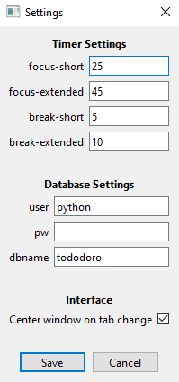
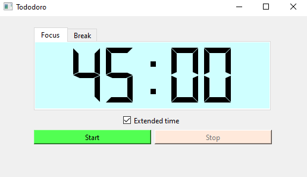
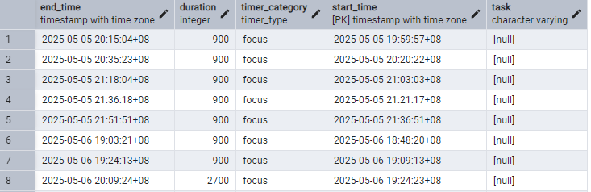
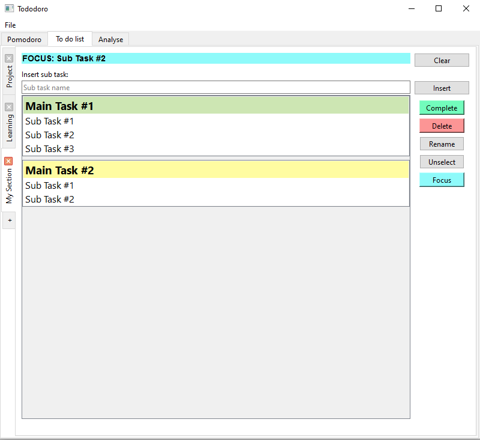

# Table of Contents
1. [Summary](#summary)
2. [Setup](#setup)
3. [Pomodoro](#pomodoro)
4. [To do list](#to-do-list)
5. [Program Structure](#program-structure)

# Summary
This is Tododoro, a pomodoro timer and a to do list with tracking using PostgreSQL database (with local server). 

Pomodoro Technique is a time management method developed in the 1980s for productivity. A timer is used to break work into intervals, typically 25 minutes of focused work separated by 5 minutes of short breaks, (see [Wikipedia](https://en.wikipedia.org/wiki/Pomodoro_Technique) for more details.)

Because this program has to communicate with an PostgresSQL server, knowledge of PostgreSQL is recommended in order to set up this program. This program works for Window OS.

# Setup
1. Setup PostgreSQL on your PC with a database and user account (user account must have read/write privileges to the database including the public schema)
2. Update the PostgreSQL infomation to the config.json file in the config folder (One workaround to not provide the password is to edit the "pg_hba.conf" file to enable server to trust the username)
3. Update the config.json file with the timing (in minutes) that you want, only a maximum of 59 mins is allowed
4. Run the tododoro_gui.py to start the timer app
5. Configurations can also be updated from the File > Settings menu, program has to be restarted manually for any changes made to the database settings for it to take place

*Updating postgres details in config file*: 
```
"postgres": {
        "user": "<SQL user name>",
        "pw": "<SQL user password>",
        "dbname": "<database name>"
}
```

*Updating pg_hba.conf file so no password is needed in the json file (the file may be stored at C:\Program Files\PostgreSQL\17\data)*:
```
# TYPE  DATABASE        USER            ADDRESS                 METHOD
# IPv6 local connections:
host    tododoro        python          ::1/128                 trust
host    all             all             ::1/128                 scram-sha-256
```

*Updating timing details in minutes in the config file (maximum of 59mins)*:
```
"timer": {
        "focus-short": 25,
        "focus-extended": 45, 
        "break-short": 10,
        "break-extended": 40
    }
```

*Updating configurations from the File > Settings menu*: \


# Pomodoro 
The section below contains information on the usage of the pomodoro timer. When the program encounter handled exceptions (i.e. unable to establish connection to the database, etc), an error message will appear. 

## Timer Usage
- Tododoro has two timers "Focus" and "Break" (only one timer can be allowed at the same time)
- The timing for the timers can be set in the config.json file (refer to section above) or from the File > Settings menu, note that the maximum limit is 59mins
- The "Extended time" check box can be toggled to switch between the short timer or the extended timer 
- Timer can be paused, resumed, and stopped 
- Once the timer is stopped, an entry of the time lapsed will be added to the SQL table, and timer will be reset
- Once the timer has successfully ended, an entry will be added to the SQL table, and timer will be reset
- A beep sound will be emitted once timer has completed 

*Interface of the timer* \


## SQL Structure 
- SQL database will consist of the table named "pomodoro" 
- SQL database will consist of five columns:
  1. **duration** *INT*: duration of the timer in seconds
  2. **end_time** *TIMESTAMP WITH TIME ZONE*: the time when the timer has completed
  3. **start time** *TIMESTAMP WITH TIME ZONE*: the time when the timer has started 
  4. **task** *VARCHAR*: this column will be NULL for now 
  5. **timer_category** *timer_type*: states whether the timer is "focus" or "break"
- If the table or column(s) does not exist, it will be created by the program 
- Program will check if:
  1. The table exist, will be created otherwise
  2. Check if the enum type "timer_type" exist, will be created otherwise
  3. Check table column heading, any missing column will be created, additional columns will be ignored (Note that the column data type are NOT checked)
- Column names are hard coded, any changes to the column name will cause the program to break
- It is better to let the program create the table for you and not mess around with the columns

*Sample of the SQL pomodoro table viewed in pgAdmin* \


# To do list
The section below contains information on the usage of the todolist. 

## To do list Usage


## Sections
- The todolist page can be divided into sections (in the image above, there are three sections; "Projects", "Learning", "My Section")
- Sections can be added by clicking the '+' tab 
- Sections can be deleted by pressing the 'x' button 
- Sections with identical names cannot be added 
- Double click on the section name to rename them 

## Adding Tasks
- Only one tasks can be selected at the same time (in the image above, the "Main Task #1" is selected)
- Tasks can be added by typing into the prompt at the top of the program and pressing "Enter" or the "Insert" button 
- To insert a main task, no task must be selected 
- To insert a sub task, select a main task to add the sub task under it 
- Tasks of the same name under the same section cannot be created 
- Reordering of the tasks are not possible, they are ordered by the time they are added
- To mass add sub tasks, use the format: ^1-5^ (for example, adding sub task "SUB TASK ^1-5^" will add 5 sub tasks called "SUB TASK 1" to "SUB TASK 5")

## Buttons 
- **Complete**: Mark the task as complete in the database and removes it from view 
  - An undo button will appear temporary on the bottom left in case the button is accidentally clicked
  - Main tasks with existing sub task(s) will not be allowed to be marked as completed 
- **Delete**: Delete the task permanently
  - for main task a window asking for confirmation will pop up
  - for sub task an undo button will appear temporarily on the bottom left 
  - When deleting sections or tasks, all task under that will be deleted permanently 
- **Rename**: Rename the task
- **Unselect**: Unselect any task selected and clears the task in the focus section
- **Focus**: Adds a task to the focus section to indicate which task to do next (in the image above, the task is "Sub Task #2")
  - the focus section is reset on every restart of the program
  - to remove the task from the focus section, use the "Clear" button (note that when the focus task is marked as complete, the focus task is not automatically cleared)


## SQL structure 
- SQL database will consist of three tables: todolist_section, todolist_main_tasks, todolist_sub_tasks
- todolist_section will consist of two columns:
  1. **section_name** *VARCHAR*: name of the sections in the to do list 
  2. **section_id** *INT*: unique id of the section name, referred to by the other tables  
- todolist_main_tasks will consist of six columns:
  1. **start_time** *TIMESTAMP WITH TIME ZONE*: time when the task is added 
  2. **end_time** *TIMESTAMP WITH TIME ZONE*: time when the task is completed, empty otherwise
  3. **main_task_name** *VARCHAR*: name of the main task in the to do list
  4. **main_task_id** *INT*: unique id of the main task, referred to by the sub task table
  5. **section_id** *INT*: refers to the section by its id
  6. **status** *status_type*: indicates whether the task is pending or completed
- todolist_sub_tasks will consist of six columns: 
  1. **start_time** *TIMESTAMP WITH TIME ZONE*: time when the task is added 
  2. **end_time** *TIMESTAMP WITH TIME ZONE*: time when the task is completed, empty otherwise
  3. **sub_task_name** *VARCHAR*: name of the sub task in the to do list
  4. **main_task_id** *INT*: refers to the main task by its id 
  5. **section_id** *INT*: refers to the section by its id
  6. **status** *status_type*: indicates whether the task is pending or completed

# Program Structure
```
|_img
  |_...
|_config
  |_config.json 
|_src
  |_db.py 
  |_overhead.py
  |_pomodoro.py
  |_todolist_main.py
  |_todolist_section.py
  |_tododoro.log
|_tododoro.py 
|_README.md
```
- **db.py** establishes connection to the SQL database and contains database related functions 
- **overhead.py** contains helper functions such as returning logger object to ensure consistent log formatting, and function to read the JSON config file
- **pomodoro.py** implements the pomodoro timer 
- **todolist_main.py** implements the to do list
- **todolist_section.py** contains all the widgets to implement the to do list
- **tododoro.log** log file is stored in the src/ folder, the log file is rewritten upon each program run
- **config.json** consists of configurations for the database and timers, and logfile formatting
- **img** folder consists of images for this README.md 

# Future Improvements 
Some possible improvement for this program:
- Data analytics to track productivity 
